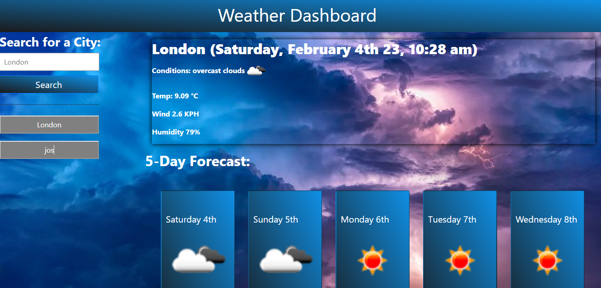

# Weather App

## Overview

This Weather App is designed 

When a user views the current weather conditions for that city they are presented with:

    The city name

    The date

    An icon representation of weather conditions

    The temperature

    The humidity

    The wind speed

When a user views future weather conditions for that city they are presented with a 5-day forecast that displays:

    The date

    An icon representation of weather conditions

    The temperature

    The humidity

When a user clicks on a city in the search history they are again presented with current and future conditions for that city.

## Deployed site

This site is deployed using [GitHub Pages](https://pages.github.com/)
at https://kifeakor22.github.io/weather-app/

## Features
- Present a form for the user to enter the name of any city they want to get weather information about.
- Present current weather condition, Temperature, Wind speed and Humidity for the city.
- Also renders 5 days future forecast for the city. 
- Stores recent search history in local storage, and renders weather forecast if the user clicks on any of the recent search history.
- Persist recent search histories between refreshes of the page but wipes the storage and build up new recent search history each time a user starts a new search after refreshing the page to save memory.

## Technologies Used
- HTML
- CSS
- JavaScript
- Local Storage

## Getting Started

To use this weather App, simply click on the deployed link, it will open in a web browser. No additional setup is necessary.

## Contributing

If you would like to contribute to this project, please fork the repository and submit a pull request.

## Support

If you have any questions or issues with the Weather App, please open an issue in this repository.
